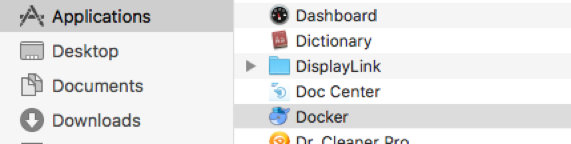
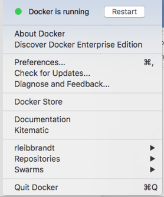
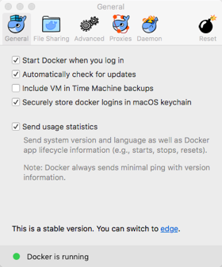
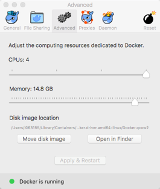
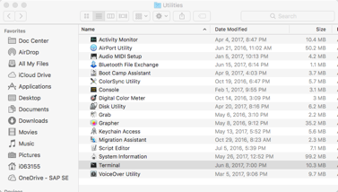

# Getting Started with SAP HANA, Express Edition and Docker
HBD165

In this session, you will learn how to get SAP HANA, express edition running in a Docker container.   This tutorial was developed for people with minimal experience in Docker.

## Background
SAP HANA, express edition is a free, resource optimized version of the SAP HANA Platform, capabile of running on laptops, desktops, small servers and cloud instances.      Docker is extremely popular amongst developers, and has been a major adoption driver for container technolgoies.

### Objectives for this session

1. Familiarize yourself with Docker for Mac.
2. Build your first Hello World app using containers.
3. Get Started with SAP HANA, express edition container. 

### Notes and Comments

For the purposes of this tutorial, we’ve attempted to minimize issues associated with internet connectivlty.    The container used in this hands on was designed specifically for this session.    Formal releases of the SAP HANA, express edition container will use volumes to persist data after the container is shut down.

Running SAP HANA, express edition on Docker for Mac has a number of caveats to consider, and is appropriate only for sandbox environments such as this tutorial.    The implementation uses a built in Virtual Machine (xhyve), and networking from the host is different to what should be expected from a linux environment.   

In summary - don't expect Docker for Mac or Windows to be as robust and flexible as the Linux versions.


## Get a Docker ID
* Go to cloud.docker.com with your web browser, and create a docker id if you don't have one yet.    If you do, feel free to reuse it, or to create one for this tutorial

## Familiarize yourself with Docker for Mac
* Launch Docker by navigating to the Applications folder (use the Finder), and doubleclick on Docker.    



On the Apple MenuBar (**top right corner of your screen**) – find the Docker icon, leftclick on it - the following window appears.



Scroll down to preferences, and click.




Click on Advanced, and increase the CPUs to 4, and the memory allocation to 12GB.


Review the settings in the file sharing section.   Any files you have to create for the tuturial has to be in one of the mapped folders.   These folders are shared with the container you create.



## Creating your first "Hello World" container application.

Containers typically leverage a console driven model - so, get ready for some typing!   Using the Finder, navigate to and doubleclick on the Terminal Application.   Go to the Applications, Utilities folder.



Once the terminal is open, type the following command at the promptl

``docker run --name helloWorld alpine echo hello``

The following text should display:

```
Unable to find image 'alpine:latest' locally
latest: Pulling from library/alpine
88286f41530e: Pull complete 
Digest: sha256:1072e499f3f655a032e88542330cf75b02e7bdf673278f701d7ba61629ee3ebe
Status: Downloaded newer image for alpine:latest
hello
```

*  If "hello" is printed, you have successfully downloaded (pulled) a container image called **alpine** (a tiny linux distribution), named the local, running instance of the container **"helloWorld"**, and ran the linux command **"echo"** with an input parameter **"hello"** in the running container.  

* If you do not get this output - the docker installation has not completed, or, the docker daemon can not connect to the internet.   (call your instructor, or retrace your steps!)

List the running Docker processes:

``docker ps -a``

Text similar to the following should display

```
CONTAINER ID        IMAGE               COMMAND             CREATED             STATUS                      PORTS               NAMES
4189381b3a95        alpine              "echo hello"        19 seconds ago      Exited (0) 18 seconds ago                       helloWorld
```

## Get the SAP HANA, express edition container running.

### Prepare the Docker for MAC envrionment, and pull the container.

The SAP HANA, express edition container is hosted on the Docker Store - a marketplace for certified docker containers.  A login is required to access the container.   You have to configure your docker client on the Mac with the Docker ID you created earlier.   

Open a Terminal and type the following, and enter your Docker ID and password when prompted:

`docker login`

**Enter your Docker ID and password when prompted.   If you do not have a docker ID, go to store.docker.com, and create a free account.**

Once your Docker client is looged in, go to store.docker.com, and search for SAP HANA, express edition.   Log in using your docker id, and click setup instructions.

Copy and paste the text on the top right hand side of the screen:

 Example:  `docker pull store/saplabs/hanaexpress:2.00.022.00.20171211.1`

You should see output similar to this:
```

docker pull store/saplabs/hanaexpress:2.00.022.00.20171211.1
2.00.020.01.20170829.3: Pulling from store/saplabs/hanaexpress
6dc83f65d9ed: Pull complete 
d878f83582e4: Pull complete 
3a7c248772c0: Pull complete 
abe9a2908c1f: Pull complete 
56f5c132ae05: Pull complete 
Digest: sha256:cb5f869a3b62e64df9812388eee9800dda7bff7ad3a1cea028c18fac228025cf
Status: Downloaded newer image for store/saplabs/hanaexpress:2.00.022.00.20171211.1

```

If you see the following message - go back to the `docker login` step - you have to be signed in to pull the container.
```
Error response from daemon: pull access denied for store/saplabs/hanaexpress, 
repository does not exist or may require 'docker login'

```

**Continue to next steps**:

* While the pull comand is running, set up xhyve on the Mac and configure the minimum requirements for the HANA container.   

*  In a terminal session (open a new one), type the following line.   This will open a shell into the xhyve hypervisor.

`screen ~/Library/Containers/com.docker.docker/Data/com.docker.driver.amd64-linux/tty`

Press enter if you see a blank screen with blinking cursur.  You should see a prompt like this if anything is ready.

```
/ # 
```

* Type or copy and paste the following commands:

```
sysctl -w net.ipv4.ip_local_port_range="40000 60999"
sysctl -w fs.file-max=20000000
sysctl -w vm.max_map_count=2048576

```

If you restart Docker or your mac, or change the networking configuration, the previous section will have to be repeated.

### Run the container


The password for the HANA container is an input to the ***"docker run"*** command.  You have to create a password file, in JSON format - here is a sample:

```
{
  "master_password" : "HXEHana1"
}
```

Copy the text above - as you can see, the default password will be HXEHana1.   (Tip):  The quotes are important

Use vi to create the password file, and save it in the  **/Users/Student/** folder. This file is deleted every time you execute the docker “run” command (later).  If you have not used "vi" before, use the following steps:

* Open another **new** terminal tab, and type the following:

``vi /Users/Student/password.json``

Type the following keystrokes/commands:

* type “i" to start editing.
* Hit Command + v to paste text copied from above
* Hit the escape key
* Type “:wq!”

The file should now be created in your Student folder. 

You're ready to instantiate the docker container now.   If the container has not been "pulled" (downloaded) yet, the run command will do that.   

```
docker run -p 39013:39013 -p 39017:39017 -p 39041-39045:39041-39045 -p 1128-1129:1128-1129 -p 59013-59014:59013-59014 -v /Users:/Users \
--ulimit nofile=1048576:1048576 \
--sysctl kernel.shmmax=1073741824 \
--sysctl net.ipv4.ip_local_port_range='40000 60999' \
--sysctl kernel.shmmni=524288 \
--sysctl kernel.shmall=8388608 \
--name macosHXE \
store/saplabs/hanaexpress:2.00.022.00.20171211.1 \
--passwords-url file:///Users/Student/password.json \
--agree-to-sap-license ---dont-check-system 
```

If the run command is succesful - "Startup Finished" will appear in your console - if not, retrace your steps - typical issues are mistakes with the passwords file.

The command above does a few different things:

*  the -p flag maps TCP/IP ports from the container to your host.  Port 39017 is the SQL port for the SYSTEMDB database.
*  the -v flag mounts the /Users folder to a location that the Docker container can use - this is important for the passwords file that we just created.
*  the various --sysctl flags sets up the container for HANA.
*  the --name flag sets the name for the new container
*  the --password-url flag points the the password file created earlier
*  the --agree-to-sap-license confirms that you have read and agreed to [this agreement](https://www.sap.com/docs/download/cmp/2016/06/sap-hana-express-dev-agmt-and-exhibit.pdf "EULA")

### Interact with the container

The container should be running on your Mac now.   Let's see what's going on inside the container:

`docker exec –ti macosHXE “/bin/bash”`

The -ti flag enables interactive mode - you should now have a shell in the container.  To confirm, type

`whoami`

You should be logged in as hxeadm (the default SAPHANA, express edition operating system user).   Running `HDB info` should return the following, or similar output:

```
USER       PID  PPID %CPU    VSZ   RSS COMMAND
hxeadm      25    24  0.0  23700  5036 -bash
hxeadm     552    25  9.0  13388  3396  \_ /bin/sh /usr/sap/HXE/HDB90/HDB info
hxeadm     583   552  100  45172  3712      \_ ps fx -U hxeadm -o user,pid,ppid,pcpu,vsz,rss,args
hxeadm     216     1  0.0  23500  1820 sapstart pf=/usr/sap/HXE/SYS/profile/HXE_HDB90_47801fe33317
hxeadm     224   216  0.3 229436 55088  \_ /usr/sap/HXE/HDB90/47801fe33317/trace/hdb.sapHXE_HDB90 -d -nw -f /usr/sap/HXE/HDB90/47801fe33317/daemon.ini pf=/usr/sap/HXE/SYS/profile/HXE_HDB90_47801fe33317
hxeadm     244   224  120 5697480 3925184      \_ hdbnameserver
hxeadm     348   224  5.5 1080704 341088      \_ hdbcompileserver
hxeadm     368   224  134 6410240 4492684      \_ hdbindexserver -port 39003
hxeadm     472   224  3.7 1089540 336712      \_ hdbdiserver
hxeadm     474   224  3.9 1293376 357116      \_ hdbwebdispatcher
hxeadm     141     1  0.1 436748 28596 /usr/sap/HXE/HDB90/exe/sapstartsrv pf=/usr/sap/HXE/SYS/profile/HXE_HDB90_47801fe33317 -D -u hxeadm

```

As we do not have a client installed on the Mac, we're going to interact with HANA from this shell (for now)

Connect to HANA using hdbsql, the command line SQL client, **and change your password if you've changed the text in the password.json file!**  

`hdbsql -i 90 -u SYSTEM -p HXEHana1 -d SystemDB` (HXEHana1 is an example!)

**Let's create a table, and add some test data:**

```
create table teched (name varchar (20), lastname varchar(50))

```

Output:

```
	0 rows affected (overall time 18.742 msec; server time 5376 usec)
```

**Add some test data:**

```
insert into teched select 'name','lastname' from DUMMY
```
Which should return the following output:

```
	1 row affected (overall time 35.706 msec; server time 3204 usec)
```

**See if it worked:**

`Select * from teched`

So - now, we have a running SAP HANA, express edition container, with a single table called Teched, with the data we inserted on your Mac.

You can quit hdbsql by typing "q" and hitting enter.

## Containers and lifecycle

##### Background related the SAP HANA, express edition container and Docker for MAC
Containers are immutable - the data inside of the container only exists for the lifecycle of that particular container.   When the SAP HANA, express edition is stopped and started, the data in HANA is preserved, but, is lost when the container is deleted.     To persist data beyond the lifecycle of a particular container, the data needs to be stored on a different filesystem, outside of that particular container.   Note that the Docker container for SAP HANA, express edition currently does not support Docker for Mac and Windows, as persisting the data on an external file system is not supported.    Review the [ instructions ] (https://store.docker.com/images/sap-hana-express-edition/plans/f2dc436a-d851-4c22-a2ba-9de07db7a9ac?tab=instructions) on the Docker store for running SAP HANA, express edition on a Linux host if you need to persist data beyond the lifecycle of a container.

For sandbox evnironments, to run SAP HANA tutorials,to learn and skill up on SAP HANA, or to use in experimental settings such as this is appropriate.

To get familiar with the container lifecycle, proceed to the following steps.

* Stop the container.   This step does not delete or remove the container, it merely suspends it.

`docker container stop macosHXE`

* Start the container.   Unlike the run command, which configures the container for use, the "start" command starts a container already configured and set up.  

`docker container start macosHXE`

* Repeat  **"Interact with the container"** section.


### Summary
The **create table** command fails, because the table already exists.   The **insert** command executes successfully, and the **select statement** returns 2 rows.   

### Delete the container, or create a new container 
In this section, attempt to create a second container, or remove the container you created, and create it again.


To remove a container, run `docker rm your_container_name_here`.


## Optional Exercises

* Install Eclipse, and connect to SAP HANA using [this tutorial](https://www.sap.com/india/developer/how-tos/2016/09/hxe-howto-eclipse.html), and use the SQL Console to query the "teched" table created above.
* Install the HANA client on the Mac using [this tutorial](https://www.sap.com/developer/how-tos/2016/12/hxe-ua-howto-installing-clients.html), and use hdbsql to connect to the container, and query the "teched" table created above.


